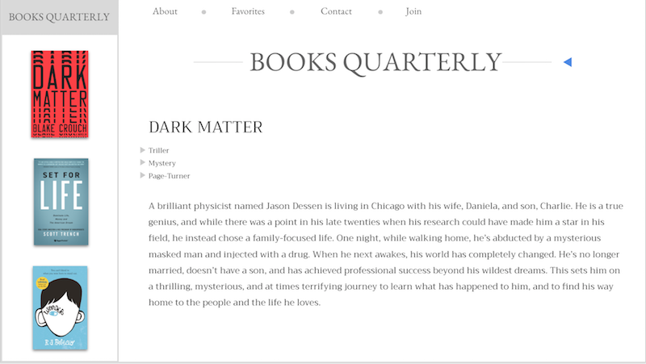
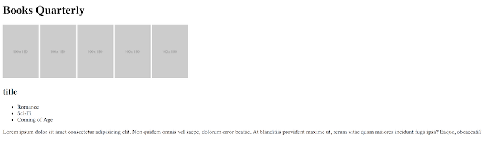

# Instructions

In this activity you will be iterating on the previous activity to get one step closer to creating the website below:

But for now, we are just working on this layout:

Follow the steps below:

* Continue working in the index.html file in `01-HTML`

* Add a list (choose wisely between ordered and unordered) for each book under the title and before the synopsis paragraph.

* In each list, add 1 to 3 list items that represent genres of the book. 

For example: 

Harry Potter would have the genres: fantasy, coming of age, action.
