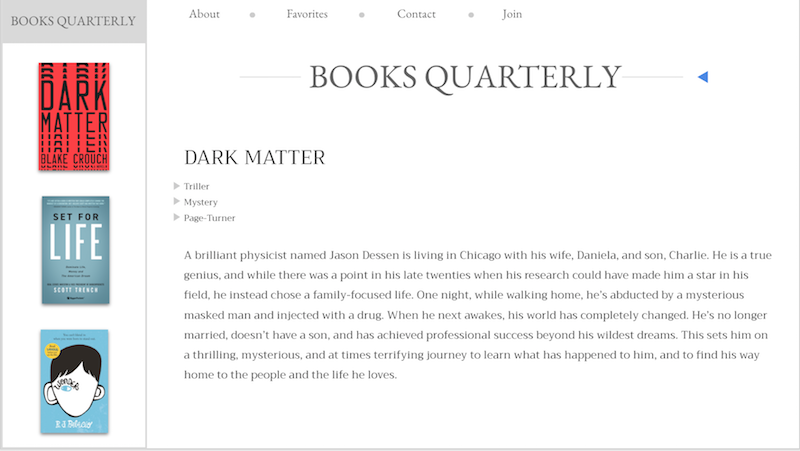
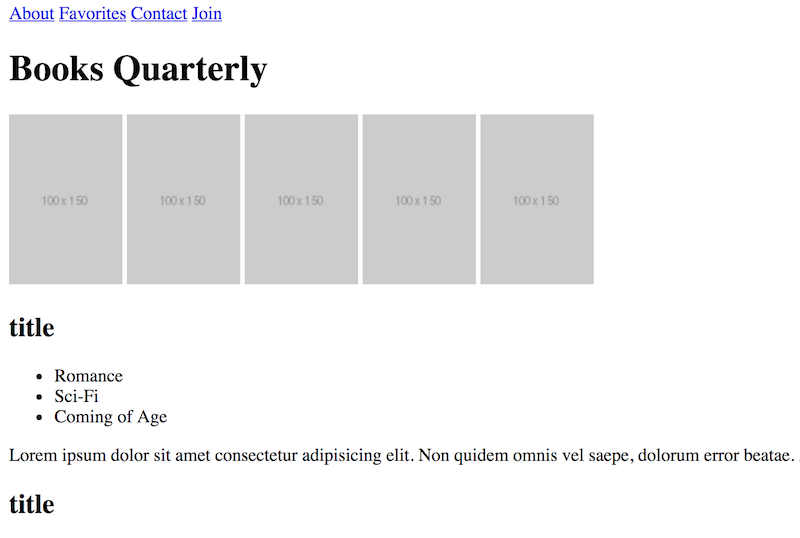

# Instructions

In this activity you will be iterating on the previous activity to get one step closer to creating the website below:

But for now, we are just working on this layout:

Follow the steps below:

* Use anchor tags to create 4 links (About, Favorites, Contacts, Join) at the top of the webpage.

* The links should open in the same tab since they are internal links. 

* For now, each tags href should equal `"#"`
