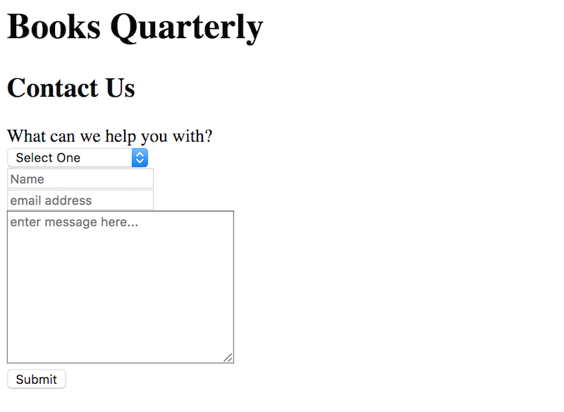

# Instructions

Work with a partner to create the form for our contact page:

* Inside `01-HTML` make a new file called `contact.html`.

* Type `!` then `enter` to add the HTML scaffolding.

* Use Google and work with your partner to mimic the layout above. 

*HINT:* You'll need `text`, `textarea`, `selection`, and `button` form elements. 