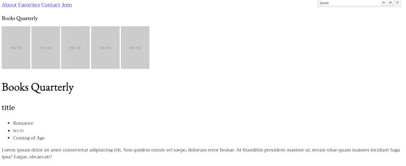

# Instructions

* First, open `01-HTML` and add a file called `style.css`.

* Import the Google fonts `EB Garamond` for primary headers and `Trirong` for everything else.

* Use the CSS to apply the appropriate font styles.

* Make the `p` line-height 1.5 and a size of `16px`

* Give `h1` a size of `40px`

* Give the `h2` a size of `24px`

* Make the font-size in `nav` `18px`

* Make the font-size of `li` elements `14px`

* Google how to give a size of `20px` to `h1`s in the `aside` tag.

----

* It's okay if you just complete the first half. After you complete the above, if you have time:

* Inside `06-Typography` you'll find a `text.html` document that is already linked to a CSS file. 

* Play around with different standard font and Google font combinations. 

* Try going to [fontjoy.com](fontjoy.com) and finding interesting font pairings. 