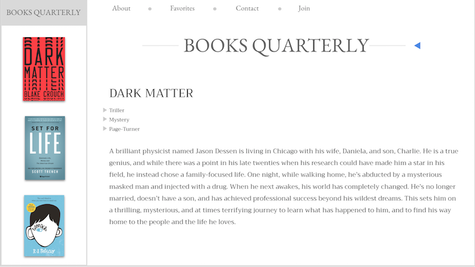

# Instructions

In this activity you will make your first website! We will be iterating on this activity over the next couple weeks to create the website below:

But for now, we are just working on this layout:

Follow the steps below:

* Copy this folder `01-HTML` into `bc` > `Activities` > `01-Unit`

* In the new copy, open `index.html` in VS Code.

* Use HTML tags inside the `body` tag to add a primary heading that says "Books Quarterly".

* Add three to five bookcover images.

* Add three secondary headings with the books title.

* Add three paragraphs summarizing the books (one below each `h2`). You can use filler text.
