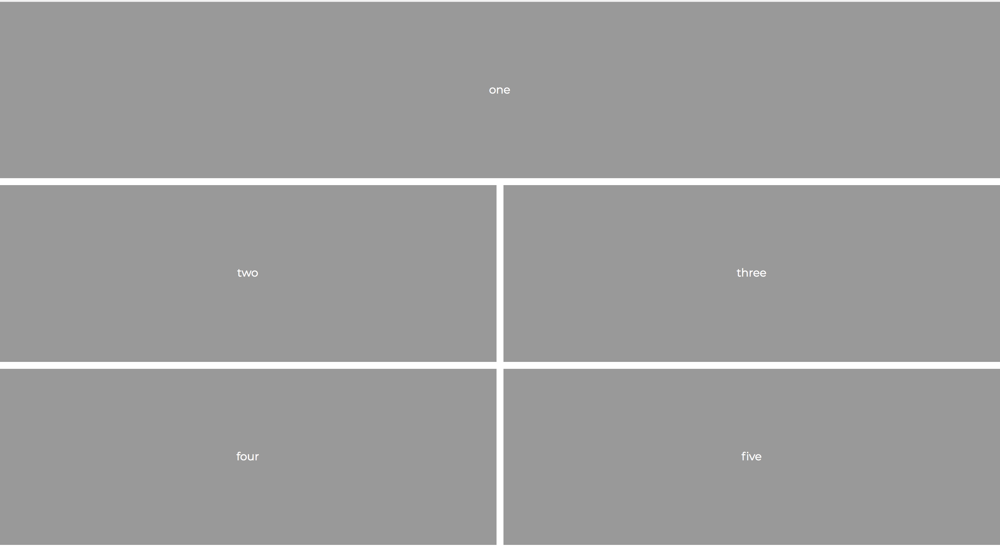

# Instructions

Use CSS Grid to match the layout below

Do each of the following:

* Count the rows and columns

* In the parent component `main` set the display to `grid`

* Add the appropriate number of rows and columns to `main` element's CSS

* Add a 10px `grid-gap`

* Set each item to span the appropriate number of rows and columns.