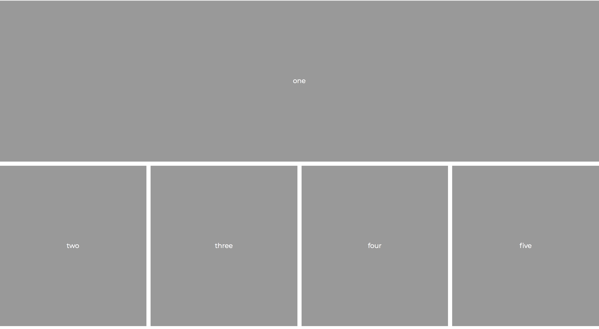
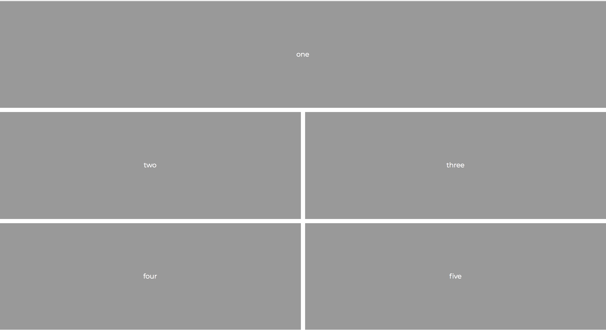

# Instructions

Use media queries to match the layout below, for desktops

Mobile layouts should still appear like the image below

* Inside the media query adjust the number of rows and columns in a desktop grid

* Adjust the number of columns that the 1st item occupies.