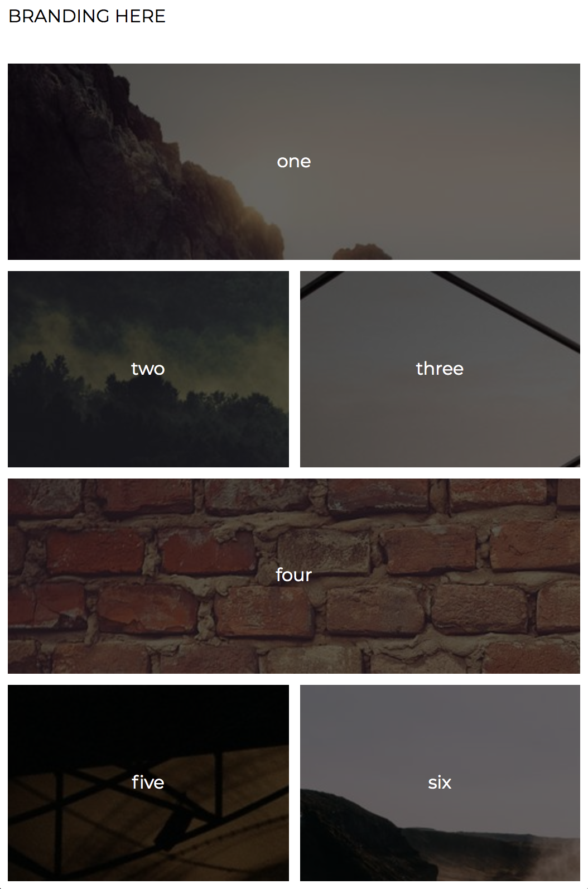

# Instructions

CSS is a deep well. There's a lot to learn and we're just skimming the surface. This is a great time to practice independent learning. 

Read through the `style.css` file with a partner.

Google to determine what *ever single line* of code does.

Play around with the file. Break things. Fix them. Make it ugly. Make it prettier. Have Fun!

**Bonus:**

If you feel like a challenge, try to add the mobile layout below as the default CSS layout

