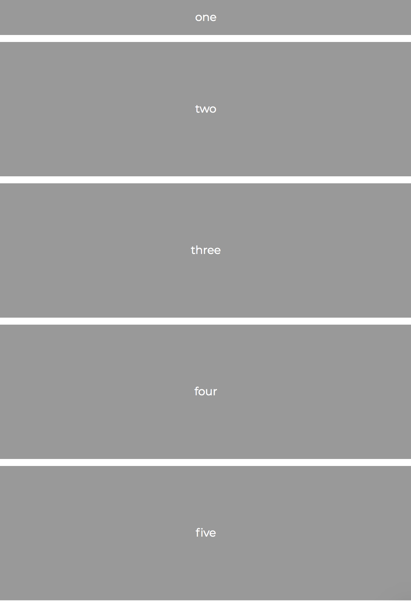
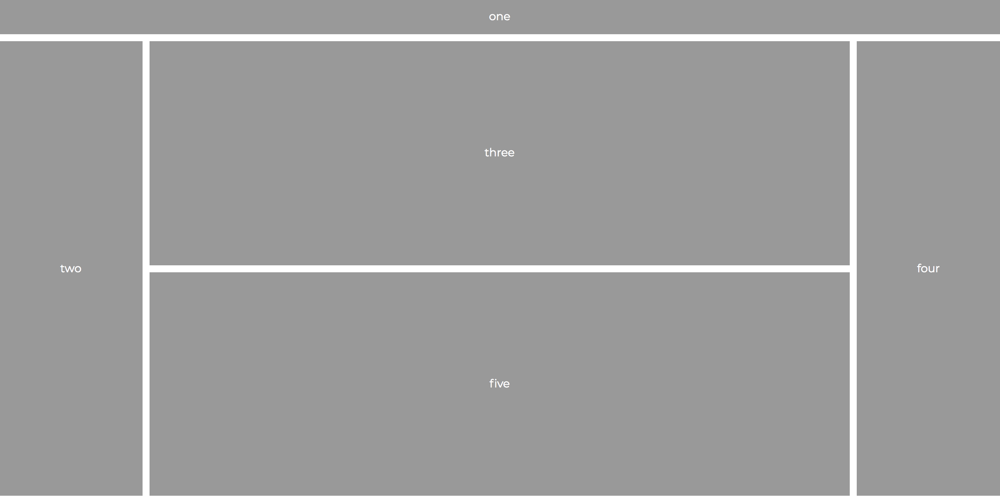

# Instructions

Use CSS Grid to match the layouts below.

Mobile: 

Desktop:

The header area should be `50px` high and the center column of the desktop layout should take up `70%`.

**Bonus:**

Put some actual content in the page. CSS Grid isn't just used for images and blocky divs. Put in some text. Play around and make it yours!