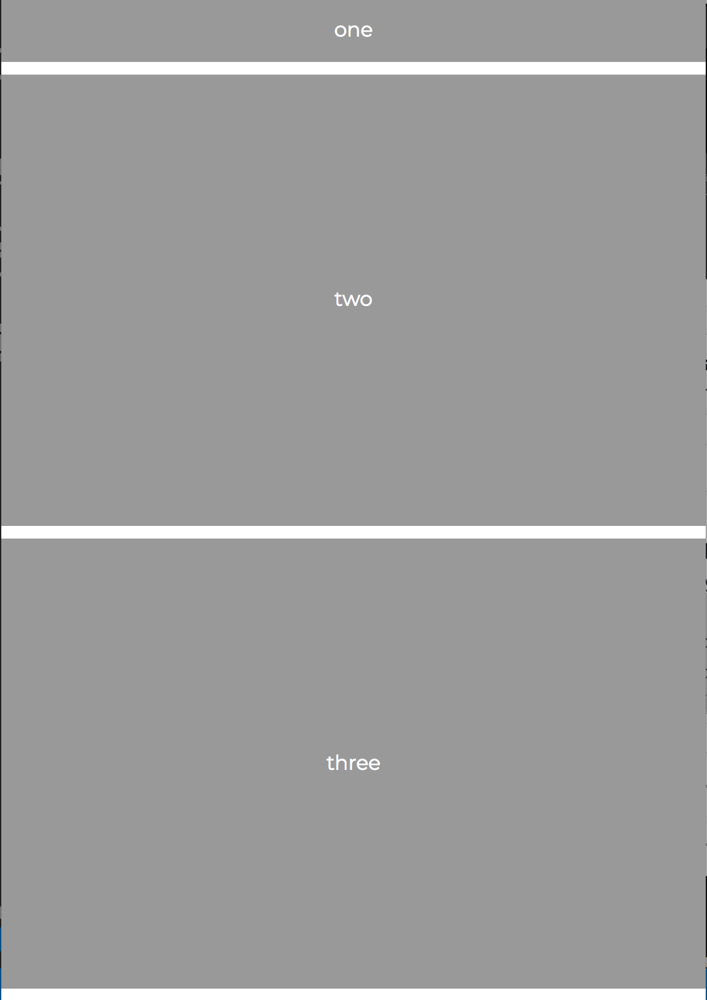
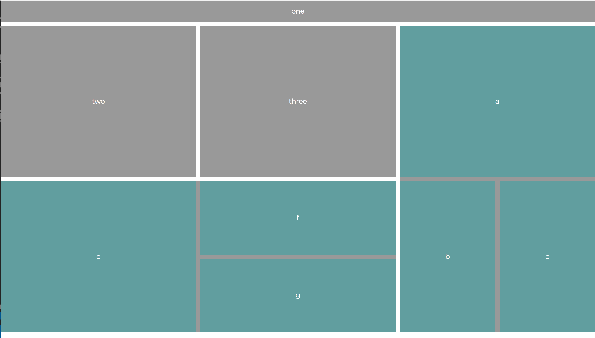

# Instructions

Use CSS Grid to match the layouts below.

Mobile: 

Desktop:

* Google to find how to make the boxes with with subboxes not display in the mobile view. 

**Bonus:**

Put some actual content in the page. CSS Grid isn't just used for images and blocky divs. Put in some text. Play around and make it yours!