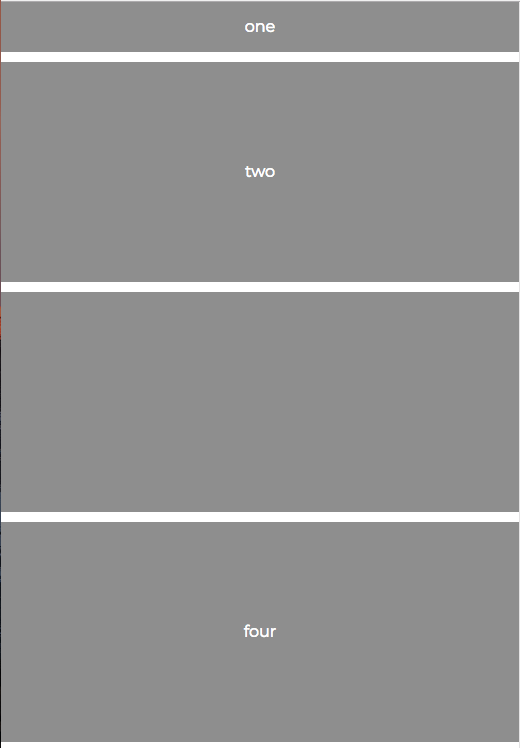
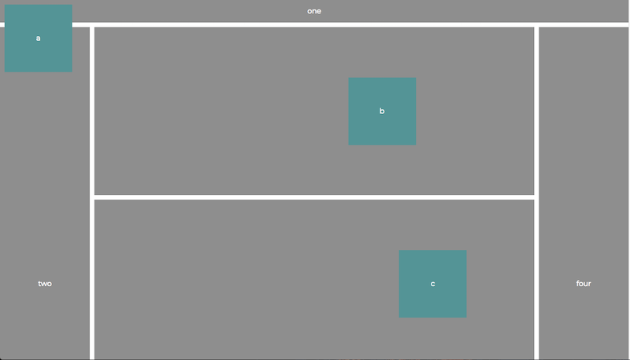

# Instructions

Use CSS Grid and the CSS position property to match the layouts below.

Mobile: 

Desktop:

* Box a should stay locked in place in the top left of the screen even when you scroll. 

* Box b should be 150px right of where it normally sits.

* Box c should be 150px from the right of its parent box.
